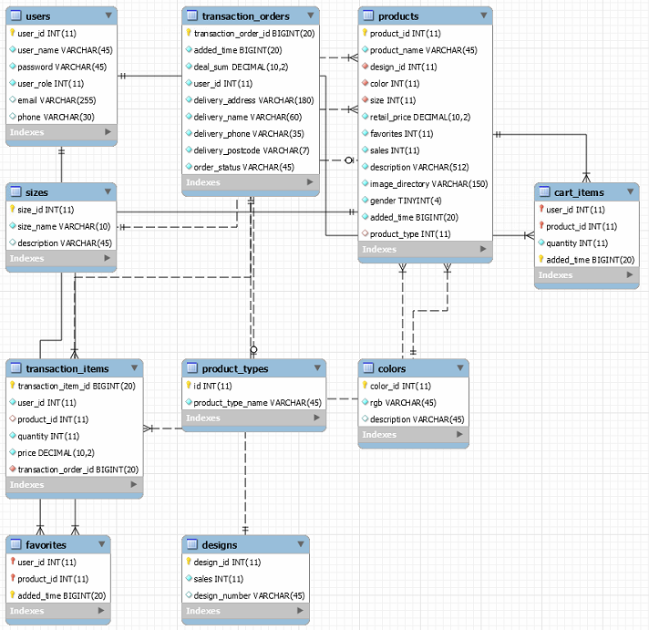
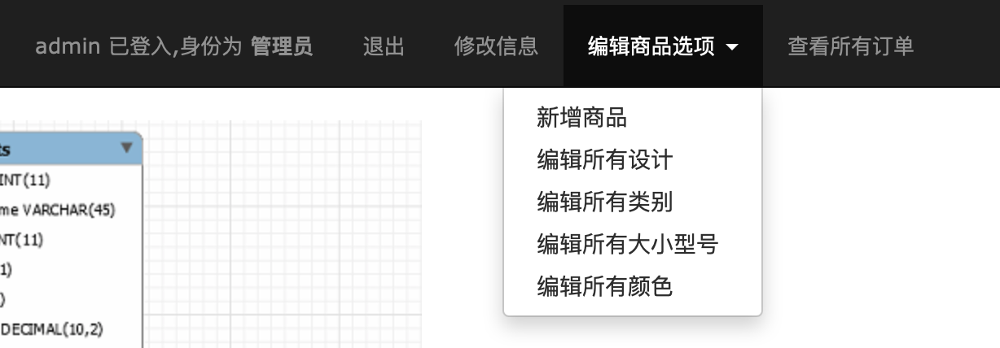

# README

## 项目介绍 

本次ruby-rails设计为一个B2C商城，管理员负责添加商品，顾客负责购买，顾客直接向商店进行"付钱"(没有真实付款接口)，因此无需记录余额。

整体架构为课上ppt中的UML图：



以上的十个实体完全实现，按照ppt中的表要求有：

|     表     |                             属性                             |                             约束                             |
| :--------: | :----------------------------------------------------------: | :----------------------------------------------------------: |
|   用户表   |                id，用户名，密码，角色，email                 |                           密码加密                           |
|   产品表   | id, 名称，描述，价格，销量，图片路径，产品类型，颜色，尺寸，设计 | 外键：产品类型，颜色，尺寸，设计，<br />has_many 购物车，订单项 |
|   颜色表   |                     id，RGB值，颜色描述                      |                      has_many: product                       |
| 产品类型表 |                       id，产品类型名称                       |                      has_many: product                       |
|   尺寸表   |                    id，尺寸名称，尺寸描述                    |                      has_many: product                       |
|   设计表   |                        id，销量，名称                        |                      has_many: product                       |
|  购物车表  |                   id，买家id，产品id，数量                   |                     外键：买家id，产品id                     |
|  收藏夹表  |                 id，买家id，产品id，添加时间                 |                     外键；买家id，产品id                     |
|   订单表   | id，买家Id，收货人，收货地址，收货电话，邮编，订单状态，总额 |                外键：买家id，has_many:订单项                 |
|  订单项表  |           id，买家id，产品id，数量，价格，所属订单           |                 外键：买家id，产品id，订单id                 |

由于脚手架生成的model自动带有created_at以及updated_at，可以不设置时间戳，直接使用这两个属性即可


## 操作介绍

初始数据：

```json
admin = {
  email: 18000000@buaa.edu.cn
  password: 123456
}
customer = {
  email: buaa@buaa.edu.cn
  password: 123456
}
```

本系统支持注册普通用户，不支持注册管理员

### 管理员操作：



大部分工作在右上角的选项当中

添加/编辑/查看/删除产品，其中新增商品在编辑商品选项的新增商品中，其他操作在首页的所有product当中会有查看详细信息或点击图片进行跳转，给管理员权限进行细节的查看以及直接修改。

增、删、改所有的设计、类别、尺寸、颜色，在添加产品之前需要先添加好设计、类别、尺寸、颜色等。

查看所有订单列表，在订单列表当中可以处理订单（发货，不设置删除选项）

修改个人信息

### 用户操作

浏览产品列表及查看单品详情，首页利用瀑布流罗列所有产品的缩略卡片

添加到购物车，首页可以添加到购物车，也可以通过右上角图标进入购物车，购物车中可生成订单，且只支持购物车中的所有东西一起形成订单

在上方列表查看自己的订单列表，在订单列表中操作（“付款”，确认收货）

添加产品到收藏夹，可以在右上角收藏夹图标进行查看，收藏夹内如首页展示商品一样展示缩略图，将产品从收藏夹内删除和在首页一样，只需要再次点击收藏即可取消收藏。

修改个人信息

### 游客操作

设置了游客可以进行的操作只有查看所有商品以及点击商品详情查看具体内容，其他操作都需要用户登录后进行。


 ## 期望目标

由于时间关系，前端不是特别的美观，在不同设备上可能样式会有些乱，最好在普通pc端查看，以后可以将前端样式变成响应式，更加稳定。

后端的搜索和分类逻辑没有写，本来在商品分类中希望设计查看所有的分类然后可以筛选出不同的商品，但是并没有实现。另外邮箱的验证也很可惜没有实现，希望以后加油。

其他部分还算可以。

祝老师和助教春节快乐！

